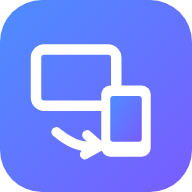

# Swipe

Share your screen from any device to any other device: phone to iPad, iPad to PC, PC to phone. It works from anywhere using just a **code and a password**. Connected devices can also **control** the shared one (mouse, keyboard, touch), with low delay.

<p align="center"></p>

## What works where

| This device… | Share its screen | Be controlled remotely | View & control others |
| --- | --- | --- | --- |
| Windows / Mac / Linux, **Swipe desktop app** | ✅ | ✅ mouse + keyboard | ✅ |
| Windows / Mac / Linux / Chromebook, **browser** | ✅ | ❌ view only (browsers can't move your mouse) | ✅ |
| Android, **Swipe app** | ✅ | ✅ taps, swipes, typing, back/home | ✅ |
| iPhone / iPad, **Swipe app** | ✅ | ❌ view only (Apple doesn't allow it, see below) | ✅ |
| Any phone or tablet, **browser** | ❌ (browsers can't capture a phone screen) | ❌ | ✅ |

So, for example:

- **Phone → iPad**: install the Android app on the phone and share. On the iPad, open the Swipe website (or app), enter the code and password, and you can tap and type on the phone from the iPad.
- **iPad → PC**: install the iOS app on the iPad and share. The PC sees the iPad screen live (view only).
- **PC → phone/iPad**: run the desktop app on the PC, then control it from the phone or iPad with touch, trackpad mode and the on-screen keyboard.

> **Why can't an iPhone/iPad be controlled?** iOS gives apps no way to tap or type on behalf of the user. That's why TeamViewer, AnyDesk and similar apps can only *view* iPhones and iPads too. Android allows control through an accessibility service, which Swipe uses.

## Quick start

### 1. Run a Swipe server (once)

Every device connects through your Swipe server. The server pairs devices by code and serves the web app. Once two devices are connected, the video goes **directly between them**.

- **Easiest:** deploy to [Render](https://render.com) for free. Go to *New → Blueprint*, pick this repository, and it uses [`render.yaml`](render.yaml). You get an address like `https://swipe-xxxx.onrender.com`. (Free instances sleep when idle, so the first visit can take ~30 s.)
- **Docker:** `docker build -t swipe . && docker run -p 8080:8080 swipe`. Put it behind HTTPS, which browsers require for screen sharing.
- **Your own server with HTTPS and a relay:** see [`deploy/`](deploy): `cp .env.example .env`, edit it, then `docker compose up -d`.
- **Local test:** `npm start --prefix server` (after `npm ci --prefix server`), then open http://localhost:8080.

### 2. Get Swipe on your devices

- **Any browser:** open your server's address. On a phone or tablet, use *Share → Add to Home Screen* for a full-screen app.
- **Desktop app (Windows, macOS, Linux):** download from the repository's [Releases](../../releases). They're built automatically when a `v*` tag is pushed. You can also grab them from the latest CI run's artifacts, or run from source with `npm ci --prefix desktop && npm start --prefix desktop`.
  - macOS: allow Swipe in *System Settings → Privacy & Security → Screen Recording* and *Accessibility*. The CI build is unsigned, so right-click the app → *Open* the first time.
  - Linux: remote control needs an X11 ("Xorg") session; Wayland blocks synthetic input.
- **Android:** install `Swipe-android.apk` from Releases (allow installing from your browser). To allow remote control, tap *Turn on remote control* in the app and enable **Swipe remote control**. On Android 13+, if the switch is greyed out, go to *App info → ⋮ → Allow restricted settings* first.
- **iPhone / iPad:** open `ios/` on a Mac, run `brew install xcodegen && cd ios && xcodegen generate`, open `Swipe.xcodeproj`, choose your Apple ID team under *Signing & Capabilities* for both targets (change the bundle IDs and the App Group if Xcode asks), and run it on your device. CI also produces an unsigned `.ipa` for sideloading tools.

In each app, enter your server address in Settings. To skip this step, set a repository variable `SWIPE_SERVER` (for example `https://swipe.example.com`) before building, and it's baked into the desktop, Android and iOS builds.

### 3. Connect

1. On the device you want to share: tap **Share** / **Start sharing**. It shows a **9-digit code** and a **password**.
2. On the other device: enter the code and password and tap **Connect**, or simply scan the QR code shown on the sharing device.

The code stays the same for each device. The password is random; you can make a new one or set your own at any time. Devices that are already connected stay connected when you change it.

## Using it

**With a mouse and keyboard:** it works like a normal remote desktop. In full screen (Chrome/Edge), keys like Esc and Alt+Tab go to the remote computer. On a Mac viewer, ⌘ is sent as Ctrl to Windows and Linux.

**With touch (phone/iPad controlling a computer):**

- *Direct mode*: tap = click, long-press = right-click, drag = drag.
- *Trackpad mode*: drag moves the pointer, tap = click, tap then drag = drag, two-finger tap = right-click.
- Two fingers = scroll, pinch = zoom into the remote screen.
- ⌨ opens the on-screen keyboard. The keys panel has Esc, Tab, arrows, sticky Ctrl/Alt/⌘ and *Paste text*.

**Controlling an Android phone:** tap, swipe and long-press map directly, and the toolbar has Back, Home and Recents. Typing goes into the focused text field.

**Toolbar:** you can also disconnect, pick a monitor (multi-screen computers), reset zoom, go full screen, and show live stats (latency, fps, bitrate, direct or relayed).

## Low delay

- Video and input travel **peer-to-peer over WebRTC (UDP)**, so there is no server in the middle when a direct path exists.
- The viewer renders frames as soon as they're decoded (`jitterBufferTarget = 0`).
- **H.264** is preferred because phones, tablets and PCs have hardware encoders and decoders for it.
- Pointer moves use an *unordered, no-retransmit* data channel, so a lost packet never holds up newer moves. Clicks and keys use a reliable channel.
- The desktop app injects input with no artificial delay; robotjs's default 10 ms per event is turned off. The Android app dispatches gestures directly.
- Quality presets: *Balanced*, *Sharp text*, *Smooth motion*. You can also set the max resolution and codec in Settings.

## Working from anywhere (TURN)

Most connections go directly between devices. Some networks don't allow that, especially phones on **mobile data** and strict company or hotel Wi-Fi. For those cases, the server should hand out a **TURN relay**:

- [`deploy/docker-compose.yml`](deploy/docker-compose.yml) includes coturn and configures everything (`TURN_URLS` + `TURN_SECRET`).
- Or use any TURN provider: set `TURN_URLS` with `TURN_USERNAME`/`TURN_PASSWORD`, or use Cloudflare's TURN service with `CF_TURN_KEY_ID` + `CF_TURN_API_TOKEN`.

Server settings (environment variables): `PORT`, `TRUST_PROXY=1` (behind a proxy), `DATA_DIR` (keeps device codes across restarts), `STUN_URLS`, `TURN_URLS`, `TURN_SECRET`, `TURN_USERNAME`, `TURN_PASSWORD`, `CF_TURN_KEY_ID`, `CF_TURN_API_TOKEN`, `MAX_VIEWERS`.

## Security

- **The password never leaves your devices.** The devices check it with [SPAKE2](docs/PROTOCOL.md#2-pairing-spake2-data-payloads), a password-authenticated key exchange. The server only relays messages, and anyone watching (including the server) learns nothing they could use to guess the password offline.
- **The server can't intercept the connection.** The WebRTC setup, including the encryption fingerprints, is sent encrypted and authenticated with a key that only devices knowing the password share. Media and input are encrypted end to end (DTLS-SRTP).
- **Guessing is throttled.** Each attempt is one guess. After 5 wrong passwords a code is locked for an increasing amount of time, and attempts are rate-limited per network.
- **You stay in control.** Hosts see who is connected and can disconnect them. The desktop app shows a notification when a device connects. You can turn remote control off and keep sharing view-only. Generated passwords have about 40 bits of randomness; if you set your own, use 8+ characters.

## Project layout

```
server/    Node.js signaling server (+ serves web/)       npm test --prefix server
web/       Web app: viewer for every device, host for desktop browsers
desktop/   Electron app: host with mouse/keyboard control  npm test --prefix desktop
android/   Android app (Kotlin): host with touch control   ./gradlew testDebugUnitTest assembleRelease
ios/       iOS/iPadOS app (Swift): host via ReplayKit       swift test (ios/SwipeCore), xcodegen
deploy/    Docker Compose with HTTPS (Caddy) and TURN (coturn)
docs/      Protocol spec and cross-platform crypto test vectors
tests/e2e  Browser + desktop end-to-end tests (Playwright)
```

Tests: `npm ci && npm ci --prefix server && npm ci --prefix desktop`, then:

- `npm test --prefix server` for the crypto vectors, signaling, lockouts and static serving.
- `npm test --prefix desktop` for the input mapping.
- `xvfb-run -a -s "-screen 0 1280x800x24" npm run test:e2e` for real browser sessions (video, wrong password, QR link, touch gestures), plus the real desktop app receiving clicks and typing from a viewer.

CI runs all of these and also builds the Windows, macOS and Linux installers, the Android APK, and the iOS app. Pushing a tag like `v1.0.0` publishes them as a GitHub Release.

## Known limitations

- iPhone and iPad can be watched, not controlled (an iOS restriction).
- Android asks for permission each time sharing starts (an Android rule). Some screens, such as password fields and banking apps, may appear black.
- On Windows, the desktop app can't control windows running as administrator unless Swipe itself runs as administrator. The secure screens (UAC prompts, lock screen) can't be controlled.
- Linux remote control needs an X11 session.
